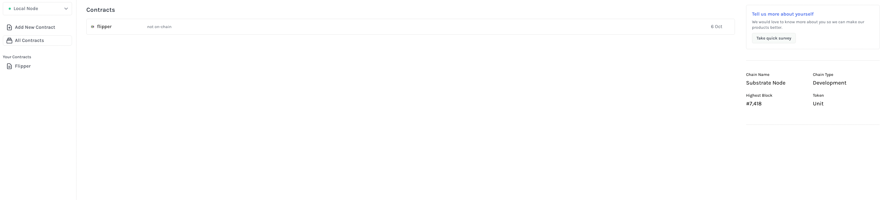
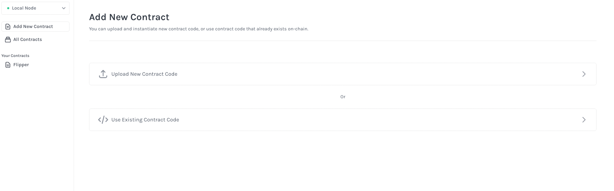

# Todo Smart Contract built with ink!


This is an example smart contract built with [ink!](https://use.ink/). It features todo application functionality. Once the contract is deployed users can view and manage todo tasks.

- [Installation](#installation)
  - [Getting Started](#getting-started)
  - [Installing Dependencies](#installing-dependencies)
  - [Compiling the Contract](#compiling-the-contract)
  - [Installing the Substrate Node Template](#installing-the-substrate-node-template)
- [Usage](#usage)
  - [Running a Local Blockchain](#running-a-local-blockchain)
  - [Using the Substrate Contracts UI](#using-the-substrate-contracts-ui)
  - [Add New Contract to the Contracts UI](#add-new-contract-to-the-contracts-ui)
- [Code of Conduct](#code-of-conduct)
- [License](#license)

## Installation

### Getting Started

To clone this repository to your local machine run the following command from your terminal:

```bash
git clone git@github.com:bencgreenberg/todo-smart-contract.git
```
Once the project has been successfully cloned to your computer, change into the root directory of the project, `todo-smart-contract`. Before proceeding forward, let's take a moment to examine the folder contents:

```
.
└── todo-smart-contract/
    ├── .gitignore
    ├── Cargo.toml
    ├── lib.rs
    ├── README.md
    ├── CODE_OF_CONDUCT.md
    └── LICENSE
```

* `lib.rs`: The code for the contract
* `Cargo.toml`: The dependencies and other information for the project, similar to a `package.json` or a `Gemfile`
* `README.md`, `CODE_OF_CONDUCT.md`, `LICENSE`: Documentation and other repository informational files

You can open up the `lib.rs` file in your code editor and inspect the code and make any changes you would like. Once you are finished, the contract must be compiled to WebAssembly (WASM). The final compiled file is what you will use on your blockchain.

## Installing Dependencies

Before you can install any ink! dependencies you must have Rust and Cargo installed on your computer. Follow [this instruction guide](https://doc.rust-lang.org/cargo/getting-started/installation.html) and return to this README when finished.

After you have Rust and Cargo installed, you will install the ink! CLI. The CLI is essential in helping manage smart contracts written in ink!. First, install the dependencies for the CLI:

```bash
$ brew install binaryen
$ cargo install cargo-dylint dylint-link
```

Then, install the ink! CLI:

```bash
cargo install cargo-contract --force --locked
```

The `--force` flag is used to ensure you are using the most updated version of the package.

Now that you have all the dependencies installed, you are ready to compile your contract into WASM and prepare it for upload to your blockchain.

### Compiling the Contract

To compile the contract make sure you are in the root directory of the project and run the following CLI command:

```bash
$ cargo +nightly contract build
```

This command will create a new `./target` folder. Within the new folder will be several files inside an `ink/` subdirectory, most notably the following:

```
.
└── todo-smart-contract/
    ├── (all the aforementioned root folder files)
    └── target/
        └── ink/
            ├── metadata.json
            ├── todo.wasm
            └── todo.contract
```

* `metadata.json`: The contract's metadata file, feel free to examine this
* `todo.wasm`: The Wasm binary for your contract
* `todo.contract`: A bundled version of both the metadata file and the Wasm binary file

The `todo.contract` file is the one you will use on your blockchain.

At this point, the contract is ready to be deployed, but you need a place to deploy it to. You will now install and run a local blockchain using the Substrate Node template.

### Installing the Substrate Node Template

To install the Substrate Node template pre-configured for contracts first ensure you are in a root directory in your machine where you would like to add a new project and then run the following:

```bash
$ cargo install contracts-node --git https://github.com/paritytech/substrate-contracts-node.git --force --locked
```

This will clone the contents of [this repository](https://github.com/paritytech/substrate-contracts-node) to your computer. After it has successfully finished cloning the repository, change into the new directory on your computer at `substrate-contracts-node/`.

## Usage

To interact with your todo smart contract you need to run a local blockchain and upload the contract file. If you have not done so yet, follow the instructions for [installing the Substrate Node template](#installing-the-substrate-node-template) before proceeding forward. The template will be used as your local blockchain on your computer. You will use the Contracts UI explained [below](#add-new-contract-to-the-contracts-ui) to upload and interact with your contract.

### Running a Local Blockchain

To run the Substrate Node template, execute the following from your command line:

```bash
$ substrate-contracts-node
```

You should start to see data being generated in your console for your blockchain activity.

### Using the Substrate Contracts UI

Now that your blockchain is running locally, you can use the Substrate [Contracts UI](https://contracts-ui.substrate.io/#/?rpc=ws://127.0.0.1:9944) to interact with it. Navigate to [https://contracts-ui.substrate.io/#/?rpc=ws://127.0.0.1:9944](https://contracts-ui.substrate.io/#/?rpc=ws://127.0.0.1:9944) and you should see something similar to this in your browser:



The UI presents several different options. First, if you have any previously uploaded contracts they will be visible in the main component of the view. In the screenshot, you see the [Flipper](https://github.com/paritytech/ink/blob/master/examples/flipper/lib.rs) contract example has been already uploaded. Second, the right-hand side of the page presents us with some data about our blockchain. It is in development mode, and it has produced over 7,000 blocks. The number of blocks should continue to increment upward as you view the Contracts UI.

The most relevant section at this moment is the left-hand navigation where you see an option to `Add New Contract`. This is the option you will use in the next section to upload your contract to your chain.

### Add New Contract to the Contracts UI

To use your contract you need to upload it to your blockchain. Within the Contracts UI, you can do that by clicking the [Add New Contract](https://contracts-ui.substrate.io/add-contract) link on the left-hand navigation. This will present a view to either upload new contract code or use existing contract code.



Choose the `upload new contract` option.

Now, you are presented with more options. You can associate the contract with a specific account. The default account is `Alice` in this test blockchain environment. You also must give you contract a descriptive name, something like: *Todo Smart Contract*. Then you are presented with a file selector tool. Click the file selector tool and choose the `todo.contract`. Once you have done so, click `Next`.


There will be another screen presented to you with various options. Leave all the options at the default choice, and click `Next` again. Lastly, there is a final view presenting a summary of your choices, click `Upload and Instantiate`.

That's it, you have successfully added the contract to your blockchain! At this point, you can call the contract within the Contracts UI. Try the `getTasks()` function in the `Message to Send` options, for example.

## Code of Conduct

This project uses the [Contributor Covenant](https://www.contributor-covenant.org/version/2/1/code_of_conduct.html) as our [Code of Conduct](CODE_OF_CONDUCT.md) to set expectations on appropriate interactions and behaviors. Any violations of the contributor covenant should be reported immediately to the project maintainers.

## License

This project is licensed under the [MIT License](LICENSE).